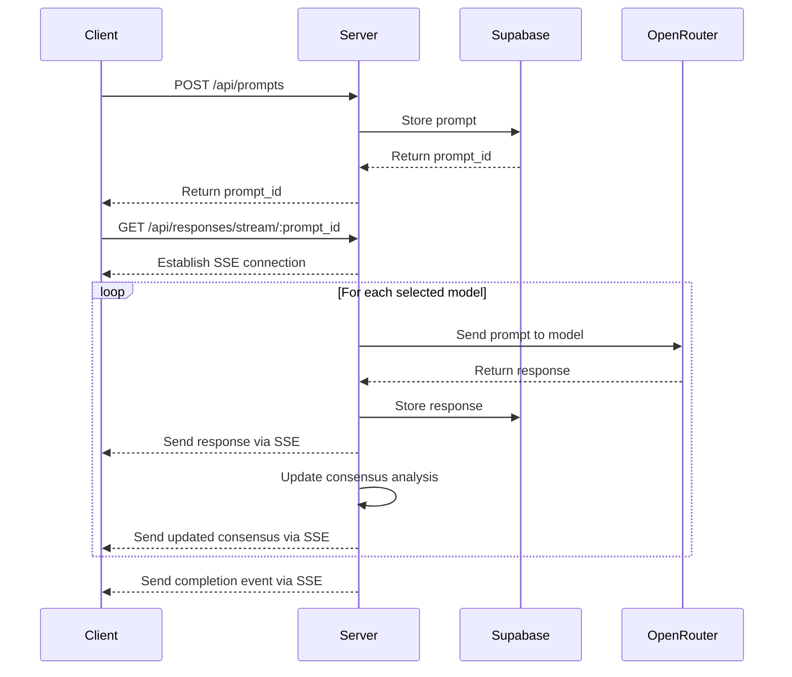
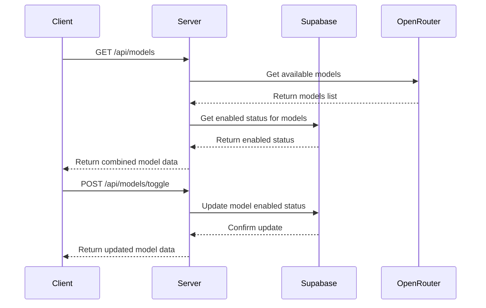
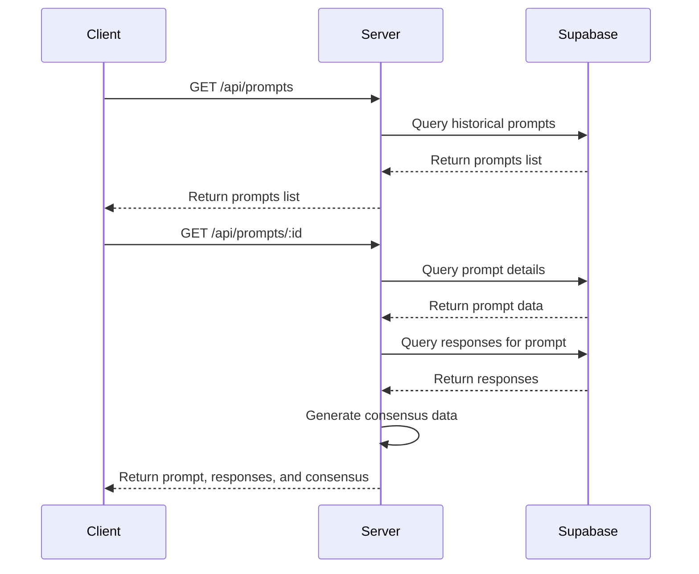

# API Design and Data Flow

This document outlines the API design and data flow for the LLM Consensus Benchmark application.

## API Endpoints

### 1. Models API

#### GET /api/models
Retrieves the list of available models from OpenRouter and the enabled status from Supabase.

**Response:**
```json
{
  "models": [
    {
      "id": "uuid",
      "name": "GPT-4",
      "provider": "OpenAI",
      "model_id": "openai/gpt-4-turbo",
      "enabled": true,
      "created_at": "2025-05-21T03:00:00.000Z"
    },
    {
      "id": "uuid",
      "name": "Claude 3 Opus",
      "provider": "Anthropic",
      "model_id": "anthropic/claude-3-opus",
      "enabled": true,
      "created_at": "2025-05-21T03:00:00.000Z"
    }
    // More models...
  ]
}
```

#### POST /api/models/toggle
Toggles the enabled status of a model.

**Request:**
```json
{
  "model_id": "uuid",
  "enabled": true
}
```

**Response:**
```json
{
  "success": true,
  "model": {
    "id": "uuid",
    "name": "GPT-4",
    "provider": "OpenAI",
    "model_id": "openai/gpt-4-turbo",
    "enabled": true,
    "updated_at": "2025-05-21T03:10:00.000Z"
  }
}
```

### 2. Prompts API

#### POST /api/prompts
Submits a new prompt to be sent to the selected models.

**Request:**
```json
{
  "text": "What is the capital of France?",
  "model_ids": ["uuid1", "uuid2", "uuid3"]
}
```

**Response:**
```json
{
  "prompt_id": "uuid",
  "text": "What is the capital of France?",
  "created_at": "2025-05-21T03:15:00.000Z"
}
```

#### GET /api/prompts
Retrieves the list of historical prompts.

**Response:**
```json
{
  "prompts": [
    {
      "id": "uuid",
      "text": "What is the capital of France?",
      "created_at": "2025-05-21T03:15:00.000Z"
    }
    // More prompts...
  ]
}
```

#### GET /api/prompts/:id
Retrieves a specific prompt and its responses.

**Response:**
```json
{
  "prompt": {
    "id": "uuid",
    "text": "What is the capital of France?",
    "created_at": "2025-05-21T03:15:00.000Z"
  },
  "responses": [
    {
      "id": "uuid",
      "model": {
        "id": "uuid",
        "name": "GPT-4",
        "provider": "OpenAI"
      },
      "response_text": "Paris",
      "response_time_ms": 1200,
      "created_at": "2025-05-21T03:15:02.000Z"
    }
    // More responses...
  ],
  "consensus": [
    {
      "group_name": "Paris",
      "count": 8,
      "color": "#3B82F6",
      "models": ["GPT-4", "Claude 3 Opus", "Gemini", "..."]
    },
    {
      "group_name": "paris",
      "count": 2,
      "color": "#10B981",
      "models": ["Model A", "Model B"]
    }
    // More consensus groups...
  ]
}
```

### 3. Responses API

#### GET /api/responses/stream/:prompt_id
Establishes a Server-Sent Events (SSE) connection to stream responses as they arrive.

**SSE Events:**
```
event: response
data: {
  "id": "uuid",
  "prompt_id": "uuid",
  "model": {
    "id": "uuid",
    "name": "GPT-4",
    "provider": "OpenAI"
  },
  "response_text": "Paris",
  "response_time_ms": 1200,
  "created_at": "2025-05-21T03:15:02.000Z"
}

event: consensus
data: {
  "groups": [
    {
      "group_name": "Paris",
      "count": 8,
      "color": "#3B82F6",
      "models": ["GPT-4", "Claude 3 Opus", "Gemini", "..."]
    },
    {
      "group_name": "paris",
      "count": 2,
      "color": "#10B981",
      "models": ["Model A", "Model B"]
    }
  ]
}

event: complete
data: {
  "prompt_id": "uuid",
  "total_responses": 10,
  "total_models": 10,
  "completed": true
}
```

## Data Flow

### 1. Prompt Submission Flow



### 2. Model Management Flow



### 3. Historical Data Flow



## OpenRouter API Integration

### Model Fetching

```typescript
// GET https://openrouter.ai/api/v1/models
async function fetchModels() {
  const response = await fetch('https://openrouter.ai/api/v1/models', {
    headers: {
      'Authorization': `Bearer ${process.env.OPENROUTER_API_KEY}`,
      'Content-Type': 'application/json'
    }
  });
  
  const data = await response.json();
  return data.data;
}
```

### Completion Request

```typescript
// POST https://openrouter.ai/api/v1/chat/completions
async function getCompletion(modelId, prompt) {
  const response = await fetch('https://openrouter.ai/api/v1/chat/completions', {
    method: 'POST',
    headers: {
      'Authorization': `Bearer ${process.env.OPENROUTER_API_KEY}`,
      'Content-Type': 'application/json',
      'HTTP-Referer': 'https://your-app-domain.com',
      'X-Title': 'LLM Consensus Benchmark'
    },
    body: JSON.stringify({
      model: modelId,
      messages: [
        {
          role: 'system',
          content: 'You are a helpful assistant. Respond with a single word only.'
        },
        {
          role: 'user',
          content: prompt
        }
      ],
      max_tokens: 10,
      temperature: 0.7,
      stream: false
    })
  });
  
  const data = await response.json();
  return {
    text: data.choices[0].message.content.trim(),
    timeMs: Math.round(data.usage.completion_ms)
  };
}
```

## Supabase Schema

### Models Table

```sql
CREATE TABLE models (
  id UUID PRIMARY KEY DEFAULT uuid_generate_v4(),
  name TEXT NOT NULL,
  provider TEXT NOT NULL,
  model_id TEXT NOT NULL UNIQUE,
  enabled BOOLEAN NOT NULL DEFAULT true,
  created_at TIMESTAMP WITH TIME ZONE DEFAULT NOW(),
  updated_at TIMESTAMP WITH TIME ZONE DEFAULT NOW()
);
```

### Prompts Table

```sql
CREATE TABLE prompts (
  id UUID PRIMARY KEY DEFAULT uuid_generate_v4(),
  text TEXT NOT NULL,
  created_at TIMESTAMP WITH TIME ZONE DEFAULT NOW(),
  user_id UUID REFERENCES auth.users(id)
);
```

### Responses Table

```sql
CREATE TABLE responses (
  id UUID PRIMARY KEY DEFAULT uuid_generate_v4(),
  prompt_id UUID NOT NULL REFERENCES prompts(id) ON DELETE CASCADE,
  model_id UUID NOT NULL REFERENCES models(id),
  response_text TEXT NOT NULL,
  response_time_ms INTEGER NOT NULL,
  created_at TIMESTAMP WITH TIME ZONE DEFAULT NOW()
);
```

### Consensus Groups Table

```sql
CREATE TABLE consensus_groups (
  id UUID PRIMARY KEY DEFAULT uuid_generate_v4(),
  prompt_id UUID NOT NULL REFERENCES prompts(id) ON DELETE CASCADE,
  group_name TEXT NOT NULL,
  count INTEGER NOT NULL,
  color TEXT NOT NULL,
  created_at TIMESTAMP WITH TIME ZONE DEFAULT NOW()
);
```

## Error Handling

### API Error Responses

All API endpoints will return consistent error responses:

```json
{
  "error": {
    "code": "error_code",
    "message": "Human-readable error message",
    "details": {} // Optional additional details
  }
}
```

Common error codes:
- `invalid_request`: The request was malformed
- `not_found`: The requested resource was not found
- `unauthorized`: The user is not authorized to perform this action
- `openrouter_error`: An error occurred when communicating with OpenRouter
- `database_error`: An error occurred when communicating with Supabase
- `internal_error`: An unexpected error occurred

### Retry Strategy

For OpenRouter API calls, implement an exponential backoff retry strategy:

```typescript
async function fetchWithRetry(url, options, maxRetries = 3) {
  let retries = 0;
  
  while (retries < maxRetries) {
    try {
      const response = await fetch(url, options);
      if (response.ok) return response;
      
      // If rate limited, wait and retry
      if (response.status === 429) {
        const retryAfter = response.headers.get('Retry-After') || Math.pow(2, retries);
        await new Promise(resolve => setTimeout(resolve, retryAfter * 1000));
        retries++;
        continue;
      }
      
      // Other error
      throw new Error(`API error: ${response.status}`);
    } catch (error) {
      if (retries >= maxRetries - 1) throw error;
      retries++;
      await new Promise(resolve => setTimeout(resolve, Math.pow(2, retries) * 1000));
    }
  }
}
```

## Security Considerations

1. **API Key Protection**: Store the OpenRouter API key securely in environment variables
2. **Input Validation**: Validate all user inputs before processing
3. **Rate Limiting**: Implement rate limiting for API endpoints
4. **CORS**: Configure proper CORS settings to prevent unauthorized access
5. **Authentication**: Implement authentication for multi-user support (optional)
6. **Data Sanitization**: Sanitize all data before storing or displaying