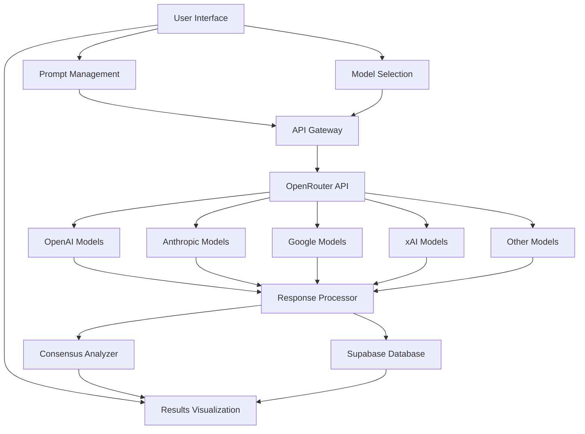

# LLM Consensus Benchmark Application - Detailed Plan

## 1. Application Overview

We'll build a web application that allows users to input a prompt, send it to multiple LLMs simultaneously via OpenRouter, and visualize the consensus among their single-word responses. The application will use Astro for the frontend, Supabase for the database, and OpenRouter for LLM integration.

## 2. System Architecture



## 3. Core Features

1. **Prompt Input**: Users can enter a prompt that requires a single-word answer
2. **Model Selection**: Users can select which LLMs to include in the benchmark (from top models available via OpenRouter)
3. **Real-time Results**: Display responses as they arrive with loading indicators
4. **Consensus Visualization**: Group and color-code similar responses
5. **Historical Data**: Store results in Supabase for future reference
6. **Model Management**: Add/remove models from the benchmark suite

## 4. Data Model

### Supabase Tables

**Models Table**
```
models
- id: uuid (primary key)
- name: string (e.g., "GPT-4", "Claude 3 Opus")
- provider: string (e.g., "OpenAI", "Anthropic")
- model_id: string (OpenRouter model identifier)
- enabled: boolean (whether the model is active)
- created_at: timestamp
```

**Prompts Table**
```
prompts
- id: uuid (primary key)
- text: string (the prompt text)
- created_at: timestamp
- user_id: string (optional, for multi-user support)
```

**Responses Table**
```
responses
- id: uuid (primary key)
- prompt_id: uuid (foreign key to prompts)
- model_id: uuid (foreign key to models)
- response_text: string (the single-word response)
- response_time_ms: integer (latency)
- created_at: timestamp
```

**Consensus Groups Table**
```
consensus_groups
- id: uuid (primary key)
- prompt_id: uuid (foreign key to prompts)
- group_name: string (the consensus word or theme)
- count: integer (number of models in this consensus)
- color: string (hex color code for visualization)
- created_at: timestamp
```

## 5. Component Structure

```
src/
├── components/
│   ├── PromptInput.astro       # Prompt input form
│   ├── ModelSelector.astro     # Model selection interface
│   ├── ResponseGrid.jsx        # Grid of model responses (React)
│   ├── ResponseCard.jsx        # Individual model response card
│   ├── ConsensusView.jsx       # Visualization of consensus groups
│   ├── LoadingSpinner.astro    # Loading indicator
│   └── Header.astro            # Application header
├── layouts/
│   └── MainLayout.astro        # Main application layout
├── pages/
│   ├── index.astro             # Home page
│   ├── history.astro           # Historical results page
│   ├── settings.astro          # Model management page
│   └── api/                    # API endpoints
│       └── prompt.js           # Endpoint to handle prompt submission
├── utils/
│   ├── api.js                  # API utility functions
│   ├── supabase.js             # Supabase client
│   ├── openrouter.js           # OpenRouter API client
│   └── consensusAnalyzer.js    # Logic for grouping similar responses
└── env.d.ts                    # TypeScript environment definitions
```

## 6. API Design

### Client-Side API

```typescript
// src/utils/api.js

// Send prompt to all selected models via OpenRouter
async function sendPrompt(promptText: string, selectedModelIds: string[]) {
  // Implementation using OpenRouter
}

// Get available models from OpenRouter
async function getModels() {
  // Implementation
}

// Toggle model enabled status
async function toggleModel(modelId: string, enabled: boolean) {
  // Implementation
}

// Get historical prompts
async function getPromptHistory() {
  // Implementation
}

// Get responses for a specific prompt
async function getPromptResponses(promptId: string) {
  // Implementation
}
```

### Server-Side API (Astro SSR)

```typescript
// src/pages/api/prompt.js
export async function post({ request }) {
  // Extract prompt and selected models
  // Send to OpenRouter API
  // Store results in Supabase
  // Return responses
}

// src/pages/api/models.js
export async function get() {
  // Return list of available models from OpenRouter
}

// src/pages/api/toggle-model.js
export async function post({ request }) {
  // Toggle model enabled status
}
```

## 7. OpenRouter Integration

We'll create a client for the OpenRouter API:

```typescript
// src/utils/openrouter.js

class OpenRouterClient {
  constructor(apiKey) {
    this.apiKey = apiKey;
    this.baseUrl = 'https://openrouter.ai/api/v1';
  }

  // Get available models
  async getModels() {
    // Implementation
  }

  // Send prompt to a specific model
  async getCompletion(modelId, prompt, options = {}) {
    // Implementation that ensures single-word responses
    // Set temperature, max_tokens, etc.
    // Return the response and timing information
  }

  // Send prompt to multiple models in parallel
  async batchCompletion(modelIds, prompt, options = {}) {
    // Implementation using Promise.all
  }
}
```

## 8. Consensus Analysis Algorithm

```typescript
// src/utils/consensusAnalyzer.js

function analyzeConsensus(responses: Array<{model: string, text: string}>) {
  // 1. Normalize responses (lowercase, trim, etc.)
  // 2. Group identical responses
  // 3. Use similarity measures for near-matches (optional)
  // 4. Assign colors to groups
  // 5. Return grouped consensus data
}
```

## 9. User Interface Design

### Main Page Layout

```
+-------------------------------------------------------+
|                     Header                            |
+-------------------------------------------------------+
|                                                       |
| Prompt Input:                                         |
| +---------------------------------------------------+ |
| |                                                   | |
| +---------------------------------------------------+ |
|                                                       |
| Model Selection:                                      |
| [x] GPT-4 [ ] Claude 3 [x] Gemini [x] Grok ...       |
|                                                       |
| +---------------------------------------------------+ |
| |                                                   | |
| |                                                   | |
| |                Response Grid                      | |
| |                                                   | |
| |                                                   | |
| +---------------------------------------------------+ |
|                                                       |
| +---------------------------------------------------+ |
| |                                                   | |
| |              Consensus Visualization              | |
| |                                                   | |
| +---------------------------------------------------+ |
|                                                       |
+-------------------------------------------------------+
```

### Response Card Design

```
+------------------------+
|      Model Name        |
+------------------------+
|                        |
|    "Single word"       |
|                        |
+------------------------+
|   Response time: 1.2s  |
+------------------------+
```

### Consensus Visualization

A horizontal bar chart showing the distribution of responses, with each consensus group having its own color. Similar responses will be grouped together.

## 10. Implementation Plan

### Phase 1: Setup and Basic Structure
1. Initialize Astro project with Tailwind CSS
2. Set up Supabase and create database schema
3. Create basic UI components
4. Implement OpenRouter API client

### Phase 2: LLM Integration
1. Implement model fetching from OpenRouter
2. Create model selection interface
3. Build prompt submission flow
4. Implement parallel request handling

### Phase 3: Visualization and Analysis
1. Develop response grid with real-time updates
2. Implement consensus analysis algorithm
3. Create visualization components
4. Add historical data view

### Phase 4: Refinement and Optimization
1. Optimize API calls for performance
2. Improve error handling
3. Enhance UI/UX
4. Add export functionality

## 11. Technical Considerations

### Performance
- Use streaming responses where available
- Implement request timeouts to handle slow models
- Use WebSockets or SSE for real-time updates

### Security
- Store API keys securely (environment variables)
- Implement rate limiting
- Validate user inputs

### Scalability
- Design for easy addition of new models as they become available on OpenRouter
- Use connection pooling for database efficiency
- Consider serverless functions for API requests

### Cost Management
- Track token usage across different models
- Implement budget controls
- Cache responses for identical prompts

## 12. Future Enhancements

1. Multi-user support with authentication
2. Advanced prompt templates
3. Export results to CSV/JSON
4. Prompt history and favorites
5. Detailed analytics on model performance
6. Support for multi-word or paragraph responses with semantic clustering
7. A/B testing of different prompt formulations